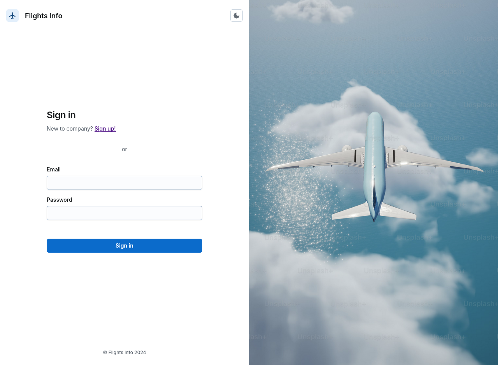
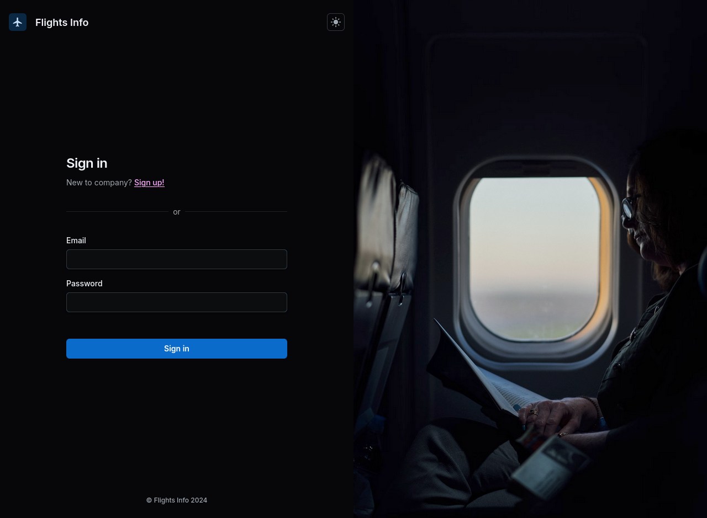
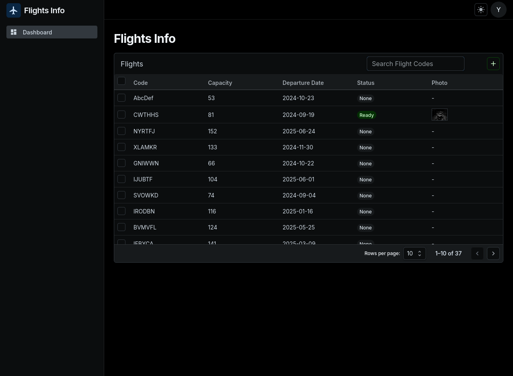
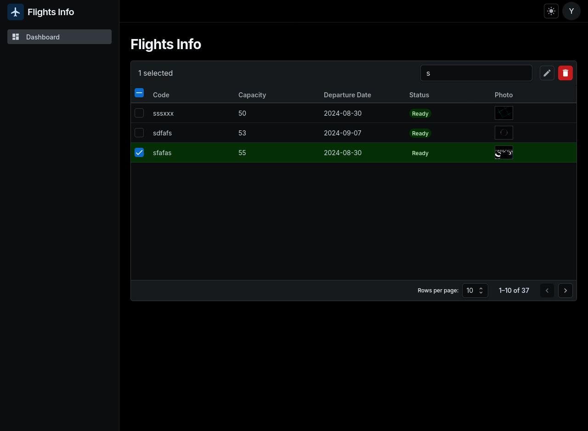
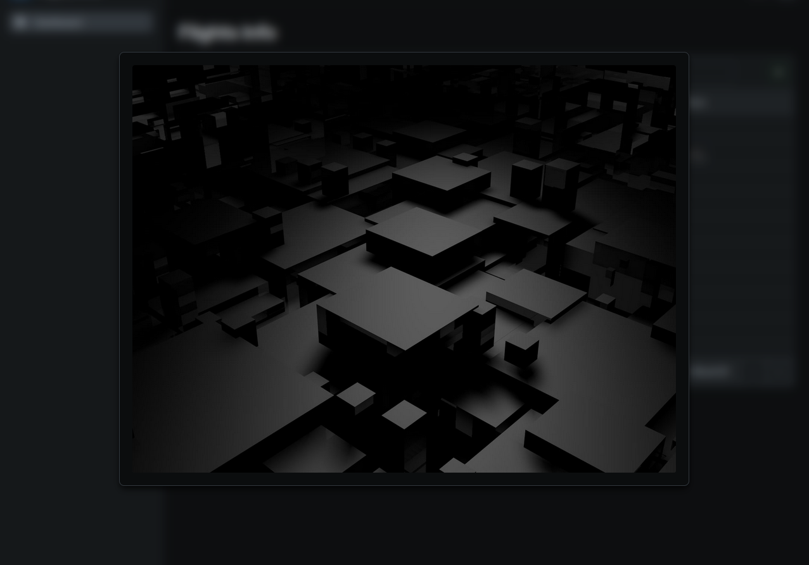
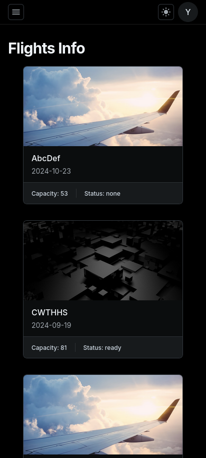
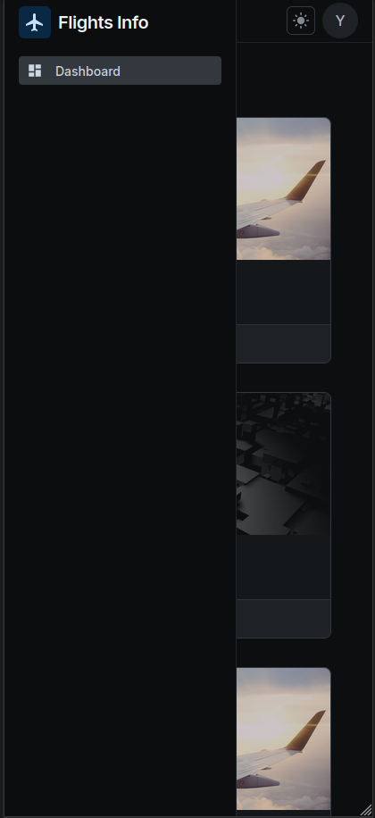
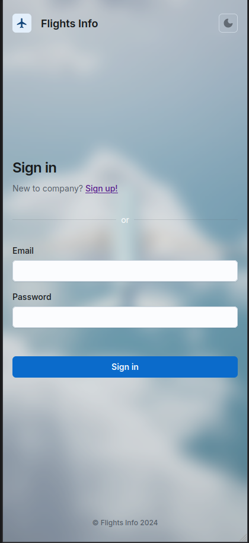
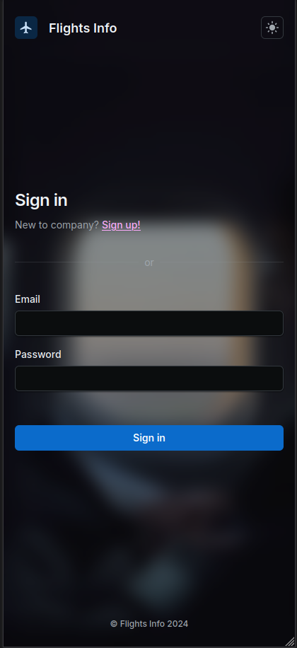

# Flights Info

This is a flight management app built with React, MUI Joy, Jotai state management and 3 of TanStack tools.
The app includes pages such as login, signup, landing page, and dashboard, and is designed to be fully mobile responsive with infinite scroll.

## Features

- **Authentication**: Secure login and signup functionalities with form validation.
- **URL synced Dashboard**: A central hub to manage and view detailed flight information shown with TanStack React Table.
- **Infinite Scroll & Responsive Design**: Optimized for both desktop and mobile devices, ensuring a seamless experience across all screen sizes.
- **State Management**: Utilizes Jotai & TanStack Query for efficient and simple state management across the app.
- **Form Handling**: Implements TanStack React Form for robust form management, including image file uploads with previews.

## Screenshots

### Desktop View

- **Landing page**  
  

- **Signin Light Mode**  
  

- **Signin Dark Mode**  
  

- **Dashboard**  
  

- **Dashboard Flight Selection**  
  

- **Flight Form**  
  

- **Image Preview**  
  

- **Signup**  
  

### Mobile View

- **Mobile View**  
  

- **Mobile Sidebar**  
  

- **Signin Mobile Light**  
  

- **Signin Mobile Dark**  
  

## Getting Started

Follow these instructions to set up the project locally.

### Prerequisites

- **Node.js**: v18 or later is recommended.
- **Package Manager**: npm or yarn.
  _flights server does not work with yarn pnp or pnpm_

### Installation

1. **Clone the repository**:

   ```bash
   git clone https://github.com/YusefNsar/flights-info.git
   cd flights-info
   ```

2. **Install dependencies**:

   ```bash
   npm install
   # or
   yarn install
   ```

3. **Start the flights server**:

   ```bash
   npm run server
   # or
   yarn server
   ```

4. **Start the development server**:

   ```bash
   npm start
   # or
   yarn start
   ```

5. **Access the app**:

   Open your browser and navigate to `http://localhost:5173` to start using the app.

## Built With

- **[React](https://reactjs.org/)** - A JavaScript library for building user interfaces.
- **[Material UI Joy](https://mui.com/joy-ui/getting-started/overview/)** - A modern UI component library.
- **[Jotai](https://jotai.org/)** - A state management library for React.
- **[TanStack Query (React Query)](https://tanstack.com/query/)** - Powerful data-fetching and caching tools for React.
- **[TanStack Table (React Table)](https://tanstack.com/table/)** - Headless UI for building tables and grids.
- **[TanStack Form (React Form)](https://tanstack.com/form/)** - Utilities for managing forms in React.
- **[Axios](https://axios-http.com/)** - A promise-based HTTP client for making API requests.
